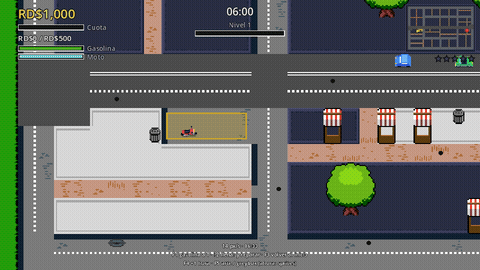
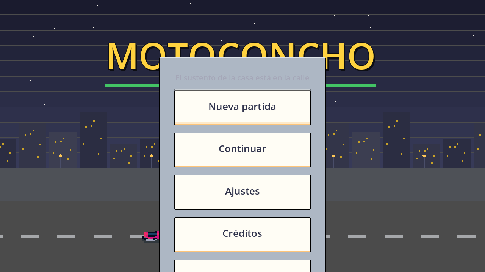
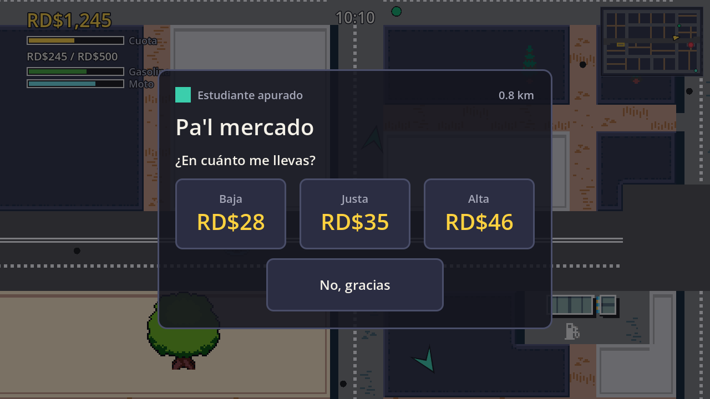
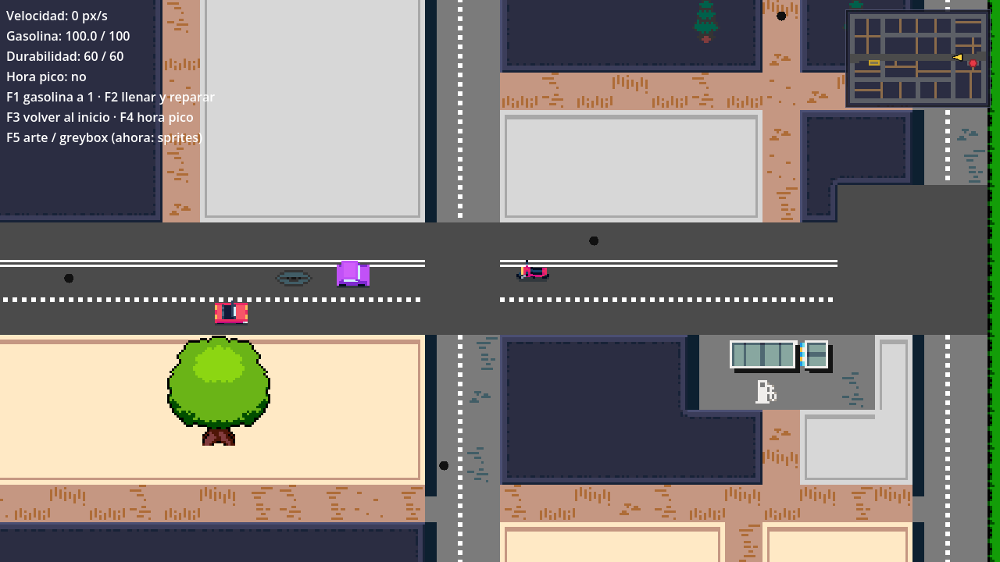
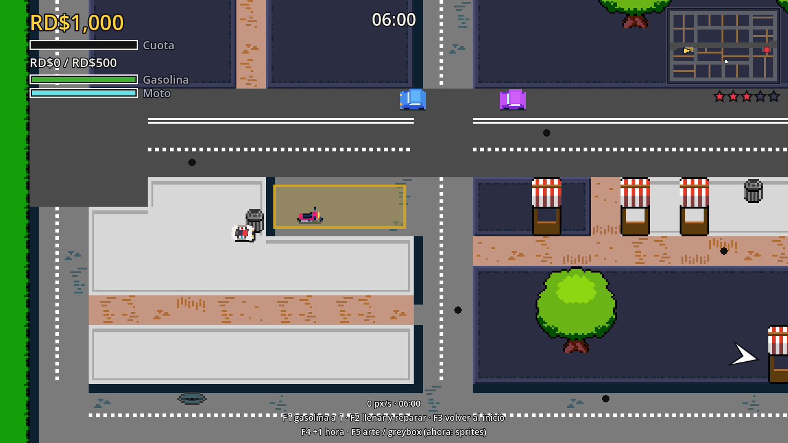
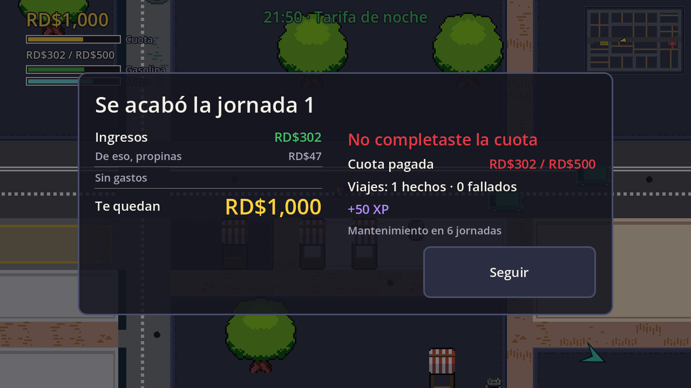
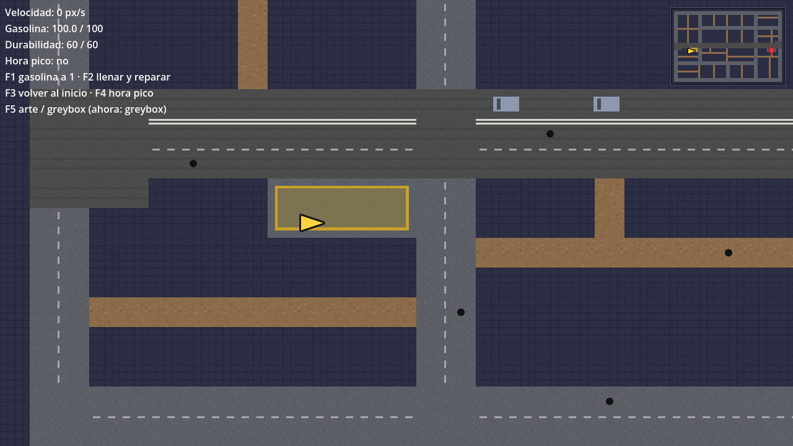

# Godot Kit (desarrollo-godot-kit)

A reusable kit that takes a 2D game idea to a playable MVP with **Godot 4 + GDScript**,
**Tiled**, and **Pixelorama**, driven by a team of Claude Code agents that work in a
`/loop` and stop at human checkpoints.

Its first game is **Motoconcho** — a top-down arcade game about a Dominican
`motoconcho` (moped-taxi) driver.



*The whole game below was built with this kit — 5 milestones, one agent team, a
`/loop`. [Full case study ↓](#example-motoconcho-built-with-this-kit)*

---

## Table of contents

- [What's in here](#whats-in-here)
- [Requirements](#requirements)
- [Installation](#installation)
- [Configuration](#configuration)
- [Usage](#usage)
  - [Start a new game](#1-start-a-new-game)
  - [Build the MVP in a loop](#2-build-the-mvp-in-a-loop)
  - [Check status](#3-check-status)
  - [Choose models per agent](#4-choose-models-per-agent)
- [The 21 MCP tools](#the-21-mcp-tools)
- [The 15 agents](#the-15-agents)
- [How a build turn works](#how-a-build-turn-works)
- [Knowledge base](#knowledge-base)
- [Example: Motoconcho](#example-motoconcho-built-with-this-kit)
- [Troubleshooting](#troubleshooting)
- [License](#license)

---

## What's in here

| Part | What it is |
| --- | --- |
| `mcp/` | `godot-kit-mcp` — a Python MCP server, 21 tools, 71 tests. |
| `agents/` | 15 specialized agents, each with a model/effort you can change. |
| `commands/` | `/new-game`, `/kit-loop`, `/kit-status`, `/set-model`, `/list-models`. |
| `skills/` | Reusable know-how: GDScript, Tiled pipeline, greybox art, pixel art, game feel, GUT testing, ElevenLabs budget. |
| `templates/project/` | The generic Godot project `/new-game` scaffolds. |
| `knowledge/` | Distilled game-dev rule cards the agents search. See `knowledge/SOURCES.md`. |
| `docs/` | The design spec and the MCP implementation plan. |

---

## Requirements

You need these installed **before** using the kit:

| Tool | Why | Check |
| --- | --- | --- |
| [Claude Code](https://claude.com/claude-code) | Runs the agents and commands | `claude --version` |
| [Godot 4](https://godotengine.org/download) (4.4+; 4.7 tested) | The game engine | see below |
| [uv](https://docs.astral.sh/uv/) + Python ≥ 3.11 | Runs the MCP server | `uv --version` |
| [Tiled](https://www.mapeditor.org/) (optional) | Level maps | `Tiled --version` |
| [Pixelorama](https://orama-interactive.itch.io/pixelorama) (optional) | Pixel art | — |
| [GUT](https://github.com/bitwes/Gut) | Godot unit tests | auto-installed per game |

The kit **auto-detects** Godot, Tiled and Pixelorama on macOS, Windows and Linux
(common install paths and `PATH`). If yours live somewhere unusual, set them per
project in `.godot-kit.toml` (see [Configuration](#configuration)).

Install `uv` if you don't have it:

```bash
curl -LsSf https://astral.sh/uv/install.sh | sh   # macOS/Linux
# or: brew install uv
```

---

## Installation

The kit is a Claude Code **plugin**. From inside Claude Code:

```
/plugin marketplace add https://github.com/MangelSP/desarrollo-godot-kit
/plugin install godot-kit
```

That registers the 15 agents, the 5 commands, the 7 skills, and the
`godot-kit` MCP server. The MCP server launches automatically via
`uvx --from <plugin>/mcp godot-kit-mcp` — no manual pip install.

**Verify it's working:**

```
/godot-kit:list-models
```

You should see a table of the 15 agents and their models. If instead you get
"command not found", the plugin didn't install — re-run `/plugin install`.

---

## Configuration

### Tool paths — `.godot-kit.toml`

Each game has a `.godot-kit.toml` at its root (the template ships one). You
only touch it if auto-detection fails:

```toml
[tools]
godot = ""        # empty = auto-detect; else full path to the Godot executable
tiled = ""        # e.g. "/Applications/Tiled.app/Contents/MacOS/Tiled"
pixelorama = ""

[elevenlabs]
reserve_credits = 1500   # audio generation never spends below this balance
```

Lookup order for each tool: `.godot-kit.toml` → environment variable
(`GODOT_BIN`, `TILED_BIN`, `PIXELORAMA_BIN`) → `PATH` → OS default locations.

### ElevenLabs (optional audio)

Audio generation is off unless you provide a key **via environment variable
only** (never in a file):

```bash
export ELEVENLABS_API_KEY="sk_..."
```

The kit refuses to generate if it would drop your balance below
`reserve_credits`, and logs every generation to `docs/audio-ledger.md`.

### Models per agent

Set once at `/new-game` (it asks for a profile) or change anytime — see
[Choose models per agent](#4-choose-models-per-agent).

---

## Usage

### 1. Start a new game

```
/godot-kit:new-game
```

The orchestrator asks a **12-question intake** one at a time (genre, core loop,
platforms, art direction, narrative yes/no, audio, out-of-scope, …). Then:

1. `game-designer` drafts `docs/gdd.md`.
2. **Checkpoint 0** — you review and approve the GDD. Nothing is built until you do.
3. `game-architect` writes `docs/architecture.md` and ADRs.
4. `producer` writes `docs/mvp-plan.md` with milestones and checkpoints.
5. The project is scaffolded from the template, GUT is installed, and Milestone 0
   is confirmed (clean import, tests green).

You end up with a Godot project that opens, imports clean, and has a plan.

### 2. Build the MVP in a loop

```
/loop /godot-kit:kit-loop
```

One task per turn: the orchestrator picks the next task, delegates it to the
right agent, runs the import and the tests, has QA and the reviewer check it,
marks it done and commits. It **stops at every human checkpoint** (e.g. "playtest
the driving") so you stay in control. Resume by running the loop again.

Run a single turn without looping:

```
/godot-kit:kit-loop
```

### 3. Check status

```
/godot-kit:kit-status
```

A read-only summary: how many tasks are done per milestone, and recent commits.

### 4. Choose models per agent

```
/godot-kit:list-models                              # current assignment
/godot-kit:set-model gameplay-programmer opus high  # one agent
/godot-kit:set-model all haiku                      # everything (cheap dry run)
/godot-kit:set-model code-reviewer sonnet medium
```

**Default profile:** orchestrator, architect, and reviewer on `opus·high`;
game-designer on `opus·medium`; the executor agents on `sonnet·medium`;
reporter on `haiku·low`. `/new-game` also offers **all-opus** (max quality) and
**budget** (cheapest) profiles.

---

## The 21 MCP tools

Agents call these; you rarely call them directly.

- **Godot:** `godot_find`, `godot_import`, `godot_test`, `godot_run_scene`,
  `godot_screenshot`, `godot_export` (APK/desktop).
- **Assets:** `tiled_export` (`.tmx` → Godot scene), `greybox_tileset`,
  `greybox_sprite`, `pixelorama_open`.
- **Audio:** `elevenlabs_balance`, `elevenlabs_sfx`, `elevenlabs_music`
  (all budget-guarded).
- **Plan:** `plan_status`, `plan_next_task`, `plan_mark`, `checkpoint_record`.
- **Intake:** `intake_questions`, `project_scaffold`.
- **Knowledge:** `knowledge_search`, `knowledge_get`.

Every tool returns `{ok, summary, ...}`, never raises, and every Godot call has
a hard timeout (Godot can hang).

---

## The 15 agents

| Agent | Model · effort | Role |
| --- | --- | --- |
| `orchestrator` | opus · high | Master plan; drives each loop turn |
| `producer` | sonnet · medium | Tasks, acceptance criteria, scope, checkpoints |
| `game-architect` | opus · high | Scenes, autoloads, signals, data, ADRs |
| `game-designer` | opus · medium | Concept, rules, economy, balance |
| `narrative-writer` | sonnet · medium | Story & dialogue (only if the game has narrative) |
| `ux-ui-designer` | sonnet · medium | Screen flows, HUD spec, touch, accessibility |
| `ui-programmer` | sonnet · medium | Implements the UI |
| `gameplay-programmer` | sonnet · medium | Rules and physics |
| `ai-programmer` | sonnet · medium | NPCs, state machines, navigation |
| `level-designer` | sonnet · medium | Tiled maps |
| `technical-artist` | sonnet · medium | Greybox, sprites, camera, effects |
| `audio-designer` | sonnet · medium | Audio (procedural or ElevenLabs) |
| `qa-tester` | sonnet · medium | GUT tests, balance sims, screenshots |
| `code-reviewer` | opus · high | Review before closing a task (read-only) |
| `reporter` | haiku · low | Status summaries |

---

## How a build turn works

Each `/kit-loop` turn, the orchestrator:

1. Calls `plan_next_task`. If it's a checkpoint, a blocked task, or "complete",
   it briefs you and stops.
2. Delegates the task to its owner agent (and to `game-designer` first if numbers
   are missing).
3. Runs `godot_import` and `godot_test`. A failure goes back to the owner once;
   a second failure blocks the task and stops the loop.
4. Has `qa-tester` add tests and `code-reviewer` review. Critical/major findings
   go back once.
5. Marks the task done, commits only that task's files, and returns a two-line
   summary.

Rules every agent follows: never invent numbers (they go to a `.tres` marked
`PROVISIONAL` and get listed in the plan), nothing outside MVP scope, no paid-API
spend without a budget line, and commit only their own files.

---

## Knowledge base

`knowledge/cards/` holds distilled game-dev rule cards (pixel art, game feel,
design, UX, Godot). Agents search them with `knowledge_search` before they act.
The cards are the owner's own study summaries of nine game-dev books, each card
naming its source. See [`knowledge/SOURCES.md`](knowledge/SOURCES.md) for the
full book list, author credits, and the takedown policy.

---

## Troubleshooting

- **`/godot-kit:*` commands not found** — the plugin isn't installed; re-run
  `/plugin install godot-kit`.
- **"Godot not found"** — install Godot 4, or set `[tools].godot` in
  `.godot-kit.toml`, or export `GODOT_BIN`.
- **MCP server won't start** — you need `uv` and Python ≥ 3.11 (`uv --version`).
- **Tiled export fails** — the kit never uses Tiled's own `.tscn` export (it
  crashes on Tiled 1.12.2); it reads the `.tmx` directly. Make sure the game has
  `tools/tiled_to_godot.gd` (the template ships it).
- **Godot editor SIGSEGV on first `--editor --quit`** — a known Godot 4.7 mono
  shutdown race on a fresh project; the second run is clean. Not a kit bug.
- **`knowledge_search` returns nothing** — the plugin's `GODOT_KIT_ROOT` isn't
  set, or `knowledge/cards/` is empty.

---

## Example: Motoconcho, built with this kit

**Motoconcho** is a top-down arcade game about a Dominican moped-taxi driver:
find passengers, haggle the fare, dodge traffic and the police, make quota
before the day ends. It was built end to end with this kit — the agents, the
`/loop`, and the MCP tools — as the kit's first real project.

| Main menu | Haggle |
| --- | --- |
|  |  |

| Driving the barrio | Police chase |
| --- | --- |
|  |  |

| End of day | Greybox mode (F5) |
| --- | --- |
|  |  |

▶️ [Watch the gameplay clip](docs/images/gameplay.mp4)

### How it was built

Each milestone was a run of `/loop /godot-kit:kit-loop`, stopping at human
checkpoints to playtest:

| Milestone | What the agents produced | Kit tools used |
| --- | --- | --- |
| **0 · Base** | `project.godot`, autoloads, data classes, GUT | `project_scaffold`, `godot_import`, `godot_test` |
| **1 · Driving** | Bike physics, camera, touch + keyboard controls | `godot_run_scene`, `godot_screenshot` |
| **2 · Barrio** | 60×40 Tiled map, traffic (cars + buses), minimap | `tiled_export`, `greybox_tileset` |
| **2.5 · Art** | Sprite-stack bike, cars, police, gas station, HUD | `greybox_sprite`, `pixelorama_open` |
| **3 · Jobs** | Passengers, haggle, fares, economy, day cycle, save | `godot_test`, balance sims |
| **4 · Risk** | Packages, heat, a patrol with a vision/chase FSM | `knowledge_search` (game AI) |
| **5 · Close** | Audio wired, leveling, main menu, final APK | `elevenlabs_sfx/music`, `godot_export` |

Along the way the kit caught real problems a solo build would miss: Tiled's
`.tscn` export crashes on 1.12.2 (the kit reads `.tmx` directly instead), the
economy paid out 8× too much until a headless balance simulation flagged it, and
the ElevenLabs budget guard kept audio generation from overspending. Every rule
number lives in a `.tres` Resource, every rule has a GUT test — the game ships
with **2,356 passing tests**.

The result runs on desktop and as an Android APK, from a main menu through a full
work day with passengers, packages, police, leveling, and a Dominican-flavored
soundtrack (merengue, bachata, dembow…).

---

## License

The kit's **code** (`mcp/`, `agents/`, `commands/`, `skills/`, `templates/`) is
MIT — see [`LICENSE`](LICENSE). The **knowledge cards** are the owner's study
summaries of third-party books; see [`knowledge/SOURCES.md`](knowledge/SOURCES.md)
for attribution and takedown policy. They are not covered by the MIT license and
are not for resale.
